# Nexora — Architecture Documentation

Structured after **arc42**, with the views drawn in the **C4** notation:
context (level 1), containers (level 2), components (level 3), and code where a
single mechanism is worth showing (level 4).

The diagrams are Mermaid and render on GitHub without a plugin.

| | |
|---|---|
| **System** | Nexora — self-hosted knowledge base |
| **Repository** | `github.com/Dschonas04/Nexora` |
| **License** | Business Source License 1.1, Apache 2.0 from 2030-08-19 |
| **Status of this document** | describes the state of the `main` branch |

**Contents**

1. [Introduction and goals](#1-introduction-and-goals)
2. [Constraints](#2-constraints)
3. [Context and scope](#3-context-and-scope) — *C4 level 1*
4. [Solution strategy](#4-solution-strategy)
5. [Building block view](#5-building-block-view) — *C4 levels 2–4*
6. [Runtime view](#6-runtime-view)
7. [Deployment view](#7-deployment-view)
8. [Cross-cutting concepts](#8-cross-cutting-concepts)
9. [Architecture decisions](#9-architecture-decisions)
10. [Quality requirements](#10-quality-requirements)
11. [Risks and technical debt](#11-risks-and-technical-debt)
12. [Glossary](#12-glossary)

---

## 1. Introduction and goals

Nexora is a knowledge base for a team that wants one without renting it: nested
pages in a block editor, spaces, sharing, versions, attachments, comments,
search, backlinks and a graph — running on hardware its owner controls, against
a database its owner can dump.

The comparison is Notion, Outline, Confluence. The difference is that all three
of those either are a service or want a runtime one has to feed. Nexora is one
Go binary, one static bundle and a PostgreSQL.

### 1.1 Requirements overview

The functional scope in one table, each row a thing a user does. The column on
the right is the licence tier that unlocks it (chapter 8.5).

| Area | Capability | Tier |
|---|---|---|
| Writing | Nested pages, block editor, autosave, drag to reorder | free |
| | Markdown and HTML import — single files or a whole ZIP | free |
| | Markdown export of a page | free |
| | Version history: snapshot before every change, browse, restore | advanced |
| | Attachments per page, with a viewer for images, PDF, text | advanced |
| | Comment threads, one reply level, settle a thread | advanced |
| | Conflict detection on concurrent edits | pro |
| | PDF and Word export of a page, export of a whole space | pro |
| Organising | Spaces, tags, favourites, collapsible sidebar | free |
| | Trash with an expiry sweep | free |
| | Full text search with ranking and snippets | free |
| | Full text search inside attachments | pro |
| | Backlinks, explicit links, `@` mentions, knowledge graph | free |
| Access | Accounts, roles, sessions one can see and end | free |
| | Per-user page shares, public read-only links | pro |
| | Groups, space permissions | business |
| | Sign-in through OIDC, sign-in against LDAP / AD | business |
| | Audit trail — recorded always, readable with a licence | business |

### 1.2 Quality goals

In order. Where two of them collide, the one further up wins, and several
decisions in chapter 9 are exactly that collision being resolved.

| # | Goal | What it means concretely |
|---|---|---|
| 1 | **The data stays reachable** | Everything except attachment bytes is in one PostgreSQL. A `pg_dump` is a complete backup. Export of a page and import of an archive are free forever, because getting one's own content out must never sit behind a payment. |
| 2 | **It starts** | Every setting has a default that produces a working server. A missing config file is not an error, a broken line in it is not an outage, an invalid licence key is not a failed boot. |
| 3 | **Access is decided in the backend** | The interface hides what is locked as a courtesy. The refusal is what protects. Every check runs server-side, in one place per question. |
| 4 | **It fits in one head** | One repository, two containers, no message broker, no build step nobody can reproduce. A reader should be able to follow a request from the URL to the SQL. |
| 5 | **Operable by one person** | Startup warnings name dangerous defaults. A maintenance page edits the config and restarts the process. The system view says which of the surrounding services answer and how fast. |

### 1.3 Stakeholders

| Role | Expectation |
|---|---|
| Instance operator (usually also the admin) | Installs with Docker Compose, upgrades by pulling and rebuilding, backs up by dumping. Wants dangerous settings named, not silently corrected. |
| Reader / writer | Wants the editor to be quick and to never lose anything. Everything else is secondary. |
| Space owner | Grants and revokes access, and wants that to take effect in the next request, not the next login. |
| Auditor | Reads the `pruefspur`. Wants entries that survive the deletion of what they refer to. |
| Licensee | Buys a tier, imports a key, expects it to work in a network with no internet access. |
| Contributor | Wants to build the free core alone, without the `premium` directory, and have everything still work. |

---

## 2. Constraints

### 2.1 Technical

| Constraint | Consequence |
|---|---|
| **PostgreSQL 16+** is required, not one database among several | The search is `tsvector` with a GIN index and a generated column; the ids are `gen_random_uuid()` from `pgcrypto`. Neither is portable, and both were chosen over portability on purpose. |
| **Go 1.25+** | Not a preference — `minio-go` requires it. |
| **Only the browser talks to the API** | There is no second client, so the API is shaped for the interface and answers JSON, not a general-purpose resource model. |
| **The backend has no Docker socket** | It cannot see the stack it runs in. What the system view reports is what can be established over the network: which services answer, how fast, which version. |
| **Verification of a licence key is offline** | No licence server exists, so a key cannot be revoked. The expiry date is the only lever there is. |
| **The container runs as uid 10001** | Any directory mounted for attachments has to belong to that uid, or uploads fail. |

### 2.2 Organisational

- **One maintainer.** Everything that cannot be operated by one person is out of
  scope: no cluster, no sharding, no separate worker fleet.
- **Business Source License 1.1**, not an OSI licence. The core may be run
  commercially; twelve extras need a key. The whole thing turns Apache 2.0 on
  2030-08-19.
- **The repository is public**, which shapes CI: no `pull_request` trigger on
  the self-hosted runner, and no Docker socket on it (chapter 7.4).

### 2.3 Conventions

- Identifiers in the code are German, prose is English (chapter 8.9).
- Comments say **why**. The code already says what.
- Handlers stay thin: parse, check access, one query, write JSON.
- New columns arrive as `ALTER TABLE ... IF NOT EXISTS` appended to the schema
  script, never by editing the `CREATE TABLE` above (chapter 8.3).

---

## 3. Context and scope

### 3.1 Business context — C4 level 1

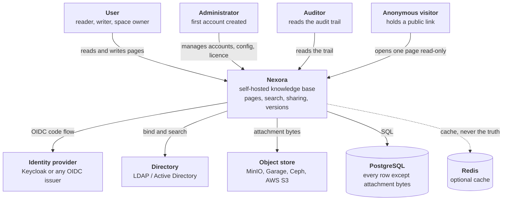

**What is inside the system:** the API, the interface, the schema and its
migration, the licence gate, import and export, the typesetting of PDF and
`.docx`, the search index.

**What is outside:** the database and its backup, the object store, the identity
provider, the directory, the reverse proxy in front, TLS certificates for a real
domain, and the operating system.

### 3.2 Technical context

| Interface | Protocol | Direction | Notes |
|---|---|---|---|
| Browser → frontend container | HTTP/1.1, HTTP/2 over TLS | in | Ports 80 and 443 in the container, published as `PORT` (3000) and `PORT_TLS` (3443) |
| Frontend nginx → backend | HTTP, `proxy_pass` on `/api` | internal | Same compose network; the backend is not published |
| Backend → PostgreSQL | PostgreSQL wire protocol, `pgx` pool | out | `datenbank_url` |
| Backend → object store | S3 HTTP API, `minio-go` | out | Only when `s3_aktiv`; path style by default, which is what MinIO wants |
| Backend → Redis | RESP, `go-redis` | out | Optional. A failure is logged, never fatal |
| Backend → OIDC issuer | OIDC discovery, authorization code flow | out | Needs `oeffentliche_url` to build the callback |
| Backend → LDAP / AD | LDAP, StartTLS by default | out | Verifies the server certificate unless told not to |
| Browser ← session | httpOnly cookie `nexora_token` | | `Secure` whenever the request arrived over TLS |

---

## 4. Solution strategy

Five decisions carry the rest of the design. Each is expanded in chapter 9.

| Problem | Approach | Because |
|---|---|---|
| Where does state live? | **One PostgreSQL for everything except attachment bytes.** No second store of record. | One dump is one backup. A knowledge base whose backup is a procedure rather than a command is a knowledge base that is not backed up. |
| How does the schema evolve? | **One idempotent script, run on every start.** New columns are appended as `ALTER TABLE ... IF NOT EXISTS`. | A fresh volume and a three-year-old one reach the same schema by the same path. No migration tool, no version table, no partially applied state. |
| Where do attachments go? | **An `Ablage` interface with two implementations**, disk and S3. The handlers never learn which. | Attachments are the only unbounded part, so they are the part that has to be movable — to another disk, a share, a bucket — without touching a handler. |
| How are paid extras enforced? | **A router middleware per extra**, answering `402`. The verifier is a separate package that can be deleted. | Enforcement in one place per feature, and a free core that still builds and runs when the licence code is removed entirely (`-tags nur_kern`). |
| How is it delivered? | **Two containers**: a Go binary and nginx with a static bundle. | Nothing to install, nothing to compile at the target, no runtime to keep current. The SPA is served by the thing that also proxies the API, so there is no CORS to configure and no second origin. |

### 4.1 Technology choices

Every technology in use, and the reason it is the one in use.

**Backend**

| Technology | Version | Role | Why this one |
|---|---|---|---|
| **Go** | 1.25 | The whole backend | One static binary, no runtime at the target, and a concurrency model that makes a request-per-goroutine server the obvious shape rather than a framework's trick. |
| **chi** | v5 | HTTP router | It is `net/http` with a router and nothing else. Route groups nest, which is exactly what the licence gate needs: one `r.Group` per paid extra, one middleware on it. |
| **pgx** | v5 | PostgreSQL driver and pool | The native protocol driver, not `database/sql` over it. It knows PostgreSQL types — `jsonb`, `uuid`, `timestamptz`, arrays — without a mapping layer inventing them. |
| **golang-jwt** | v5 | Session token | The token says *who*; the `sitzungen` row says whether it still counts (chapter 8.1). Signed, not encrypted: it carries no secret. |
| **golang.org/x/crypto** | | bcrypt password hashing | The cost is tunable and the algorithm is the boring, correct choice for password storage. |
| **go-oidc** + **oauth2** | v3 | Sign-in through an OIDC provider | Discovery document, JWKS fetch and ID-token verification are exactly the parts one must not hand-roll. |
| **go-ldap** | v3 | Sign-in against a directory | Bind, search, StartTLS. Nothing else is needed. |
| **minio-go** | v7 | S3 client | Talks to MinIO, Garage, Ceph and AWS through the same API, and defaults to path style, which is what self-hosted stores want. |
| **go-redis** | v9 | Optional cache | Only as a cache. Nothing is only in Redis (chapter 8.8). |
| **pdftotext** (poppler) | | Text out of PDF attachments | The one external binary in the image. Pure-Go extraction manages the simple cases and fails on the real ones: font encodings, columns, embedded images. |

Written by hand rather than pulled in: the **PDF writer** and the **`.docx`
reader and writer** (`internal/dok`), the **Markdown and HTML parser**
(`internal/einlesen`), and the **config file parser** (`internal/config`). Each
is small, each has tests, and each avoids a dependency whose surface would be
larger than the feature.

**Frontend**

| Technology | Version | Role | Why this one |
|---|---|---|---|
| **React** | 18 | Interface | The editor that fits the data model is a React component; everything else follows from that. |
| **TypeScript** | 5.5 | Types across the client | The `Extra` union in `lizenz.tsx` turns a mistyped feature name into a build error instead of a control that silently never unlocks. |
| **Vite** | 5 | Dev server and bundler | Fast rebuilds, and `npm run build` is `tsc && vite build`, so a type error stops the build. |
| **BlockNote** | 0.15 | Block editor | Produces a block document as JSON, which is what `pages.content` stores verbatim. Slash menu and Markdown shortcuts come with it. |
| **TipTap / ProseMirror** | 2.27 | Under BlockNote | Not used directly; it is what BlockNote is built on. |
| **React Router** | 6 | Routing | The interface is one SPA with a handful of views. |

**Delivery**

| Technology | Role | Why this one |
|---|---|---|
| **PostgreSQL 16** | The store of record | `tsvector` with a generated column and a GIN index is a real search. `jsonb` holds the block document without a schema for it. `gen_random_uuid()` from `pgcrypto` makes ids the database's job. |
| **Docker Compose** | Delivery | Two services in the main file; database, object store and cache in side files, because most installations already run those and chaining them here would mean operating them twice. |
| **nginx 1.27 alpine** | Serves the SPA, proxies `/api`, terminates TLS | One origin for interface and API, so no CORS. Issues a self-signed certificate on first start and keeps it in a volume, so a rebuild does not produce a fresh browser warning. |
| **Alpine 3.19** | Runtime image | The binary is static; the image exists for `poppler-utils`, a non-root user and a data directory. |

---

## 5. Building block view

### 5.1 Level 1 — the system decomposed

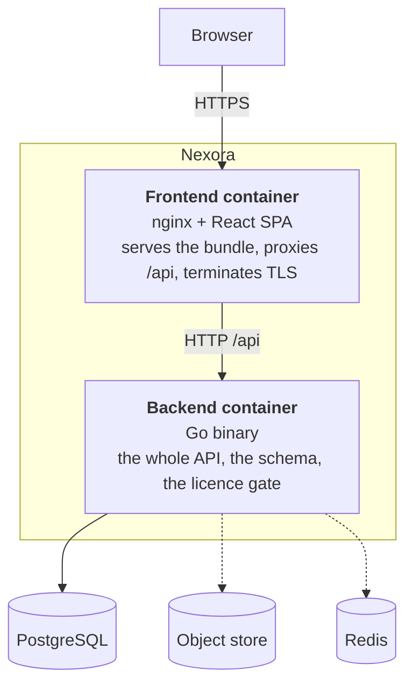

Two deployable units and nothing else. There is no worker, no scheduler
container, no queue: the two periodic jobs Nexora has — the trash sweep and the
session sweep — are goroutines with a ticker inside the backend process
(chapter 6.6).

### 5.2 Level 2 — containers

#### Frontend container

| Building block | Responsibility |
|---|---|
| `nginx.conf` | One server block on 80 and 443. Serves `/` from the built bundle with an SPA fallback, `proxy_pass`es `/api` to the backend, gzips, caps a body at 25 MiB, offers only TLS 1.2 and 1.3 |
| `tls-start.sh` | On first start, issues a self-signed certificate (825 days) into `/etc/nginx/tls` and leaves any certificate already there alone |
| `dist/` | The Vite build output: `index.html` plus hashed asset bundles |

#### Backend container

The Go binary, decomposed in 5.3. Around it: `poppler-utils` for `pdftotext`, a
user with uid 10001, and `/data/attachments` declared as a volume so a fresh
named volume inherits that ownership instead of belonging to root.

### 5.3 Level 3 — components of the backend

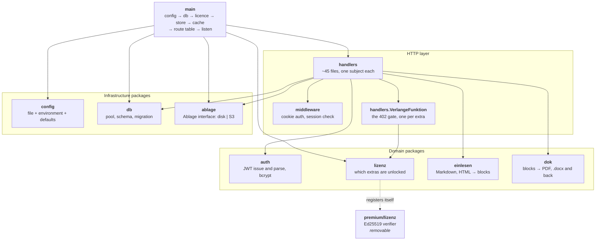

The dotted edge is the one that carries the design: `internal/lizenz` defines
the gate and knows nothing about signatures. `premium/lizenz` registers itself
as the verifier in an `init`. Delete the directory, build with `-tags nur_kern`,
and the gate answers "no verifier present" for every extra — the free core, with
no licence code compiled in at all.

#### The packages

| Package | Responsibility | Notable |
|---|---|---|
| `internal/config` | Reads `config.conf`, lets the environment override, falls back to built-in defaults. Also `Warnungen()`, the list of dangerous settings named at every boot | A hand-written parser for a deliberately dull `key = value` format. A broken line is reported with its number and skipped, never fatal |
| `internal/db` | Pool via pgx, and `Migrate` — the whole schema as one idempotent script | No migration tool and no version table; see [ADR-2](#adr-2-the-schema-is-one-idempotent-script) |
| `internal/auth` | Issues and parses the JWT, hashes and checks passwords | The token carries user id and session id, nothing else |
| `internal/middleware` | `Auth`: validates the cookie, then asks a `SitzungPruefer` whether the session still counts, then injects the user id into the context | Answers 401 identically for missing and invalid, so nothing is learned from the difference |
| `internal/lizenz` | The feature names, the four tiers, `Frei(f)` — and the `Pruefer` interface a verifier registers against | Contains no cryptography |
| `internal/ablage` | `Ablage`: `Schreiben`, `Lesen`, `Loeschen`, `Name`. Implementations `platte.go` and `s3.go` | A failed write leaves nothing behind; deleting what is already gone is not an error |
| `internal/einlesen` | Markdown and HTML into BlockNote blocks: `markdown.go`, `html.go`, `bloecke.go`, `inline.go` | The import side. Hand-written, tested against real Obsidian, Notion and Confluence exports |
| `internal/dok` | Typesetting: `pdf.go`, `docx.go`, `word_lesen.go`, image embedding, font metrics | Written without a third-party library. The PDF uses base fonts and WinAnsi encoding, so umlauts survive |
| `internal/models` | The structs that cross the API boundary | |
| `internal/handlers` | Everything else: one file per subject | Every handler is a method on `Server` and decides access itself through `access.go` |
| `premium/lizenz` | Verifies an Ed25519-signed key against a public key baked into the source | Offline. No licence server exists |
| `premium/cmd/schluessel` | Issues keys | The only place the private key is used |

#### The handlers, by subject

| Subject | Files |
|---|---|
| Sign-in and identity | `auth.go`, `benutzername.go`, `sso.go`, `sso_keks.go`, `ldap.go`, `sitzungen.go`, `sitzungsspeicher.go` |
| Pages | `pages.go`, `versions.go`, `reihenfolge.go`, `breite.go`, `papierkorb.go`, `markdown.go` |
| Access | `access.go`, `sharing.go`, `oeffentlich.go`, `gruppen.go`, `users.go` |
| Attachments | `attachments.go`, `dateiausgabe.go`, `anhangtext.go`, `anhangindex.go`, `word.go`, `s3einbindung.go` |
| Organisation | `spaces.go`, `tags.go`, `volltext.go`, `volltext_nachziehen.go`, `links.go`, `backlinks.go`, `graph.go` |
| Collaboration | `kommentare.go`, `erwaehnungen.go`, `postfach.go`, `pruefspur.go` |
| In and out | `einfuhr.go`, `export.go`, `exportdateien.go`, `gesetzt.go`, `bildquelle.go` |
| Operations | `wartung.go`, `einstellungen.go`, `verbund.go`, `redis.go`, `lizenz.go`, `lizenzverwaltung.go` |
| Shared | `server.go`, `leser.go` |

### 5.4 Level 3 — components of the frontend

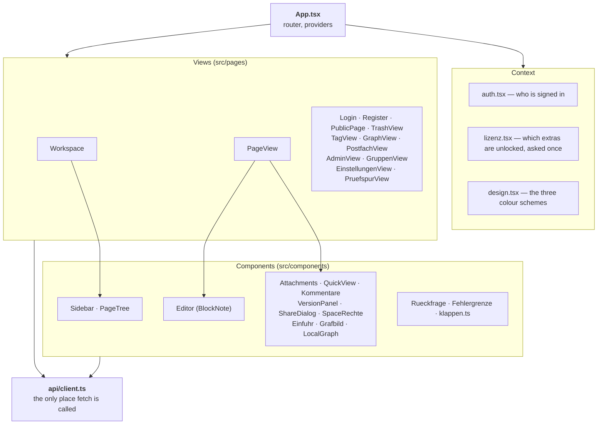

Two rules hold this together. **`api/client.ts` is the only module that calls
`fetch`**, so the cookie handling, the JSON decoding and the 401/402 reaction
exist once. And **`lizenz.tsx` exports an `Extra` union** of the same strings the
backend uses, so a control gated on a feature name that does not exist fails to
compile rather than failing to appear.

### 5.5 Level 4 — the permission check

One function is worth showing at code level, because it is the one that decides
who sees what, and because its shape is a decision rather than an
implementation: `Server.pagePerm` in `handlers/access.go`.

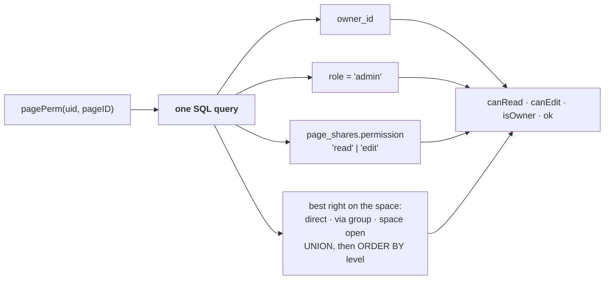

Everything is resolved in **one** query, and that matters more than it looks.
This function runs on every request that touches a page. Split across several
queries, the parts would drift, and a drifting permission check is how pages end
up visible to the wrong people. Nothing is cached either: a share revoked in one
tab takes effect in the next request from another.

The space rights branch is conditional on the `gruppen` extra being licensed.
The rows are not deleted when a licence lapses — they simply grant nothing, and
access falls back to owner, admin and direct page shares.

---

## 6. Runtime view

Six scenarios. They were picked because each one shows a mechanism that recurs
everywhere else.

### 6.1 Signing in

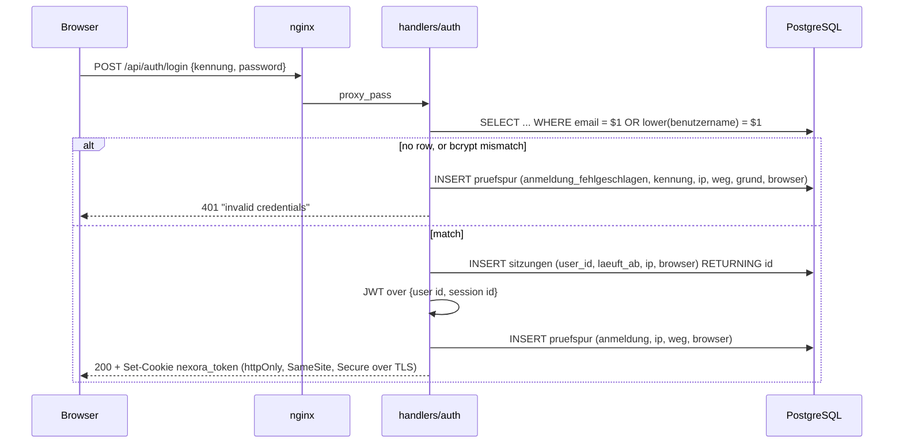

Three things in this diagram are deliberate. **One message for both failure
cases**, so the response cannot be used to enumerate which addresses are
registered. **The failed attempt is recorded** — a trail without failed sign-ins
lacks exactly the events one opens it for. And the **`kennung` field takes either
an address or a login name**; the `@` decides which was typed, and the SQL asks
for both.

### 6.2 A request that touches a page

Every authenticated request runs the same two stages before a handler sees it.

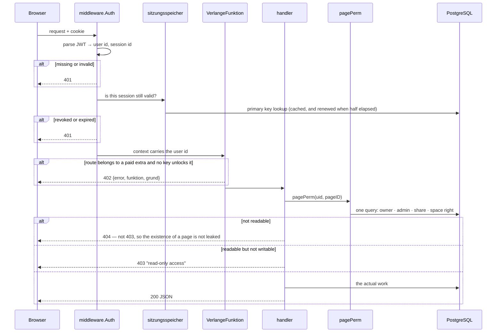

**Why the token alone is not enough.** A signed token is valid until it expires
and can be stopped by nothing: signing out only drops the cookie, so whoever
copied the token beforehand stays signed in, and a lost laptop cannot be locked
out without ending everybody's session. So the token says *who it was* and the
`sitzungen` row says *whether it should still count*. The price is one primary
key lookup per request, cached on top.

**Why 404 and not 403.** Answering "forbidden" for a page one may not read
confirms that the page exists. The two cases are only told apart once read
access is established.

### 6.3 Saving a page — autosave, snapshot, conflict

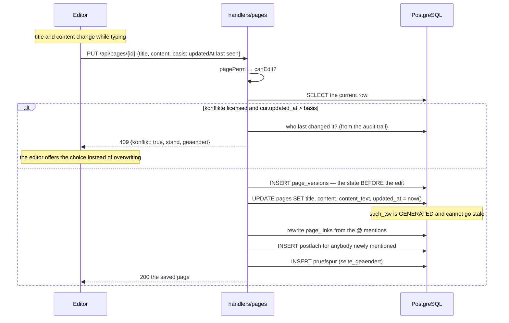

Details that are decisions rather than accidents:

- **Compared down to the microsecond.** That is the resolution `timestamptz`
  keeps and the one that survives the round trip through JSON. Rounding to whole
  seconds would blind the check to two saves inside one second — and the autosave
  saves exactly that fast.
- **The snapshot is of the state before the edit**, so restoring a version puts
  back what was there previously. Snapshots coalesce, or the autosave would fill
  the history with one entry per keystroke.
- **A user with edit access may change content but not re-parent the page.**
  Moving it is a structural change to the owner's workspace and could pull a page
  out of the tree its owner can see. Only the owner and an admin may do that.
- **`content_text` is written on save** and `such_tsv` is a generated column over
  it plus the title. The index therefore cannot drift from the content, no matter
  which code path wrote the row.

### 6.4 Uploading an attachment

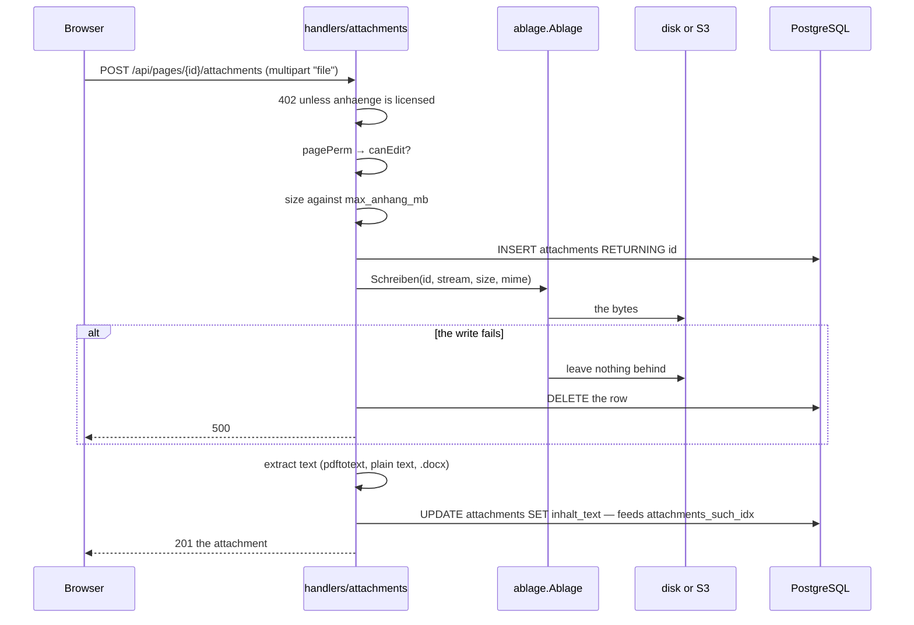

The handler never learns whether `A` is a directory or a bucket. That is the
whole point of the interface: an installation moves its attachments into an
object store by setting `s3_aktiv`, and no handler changes.

Serving one back is not symmetric. The MIME type of an upload is whatever the
uploader claimed, so handing it back unchanged and `inline` would let somebody
put an HTML or SVG file on a page that the browser then executes on Nexora's own
origin. `dateiausgabe.go` decides the headers instead of trusting the column.

### 6.5 Signing in through an identity provider

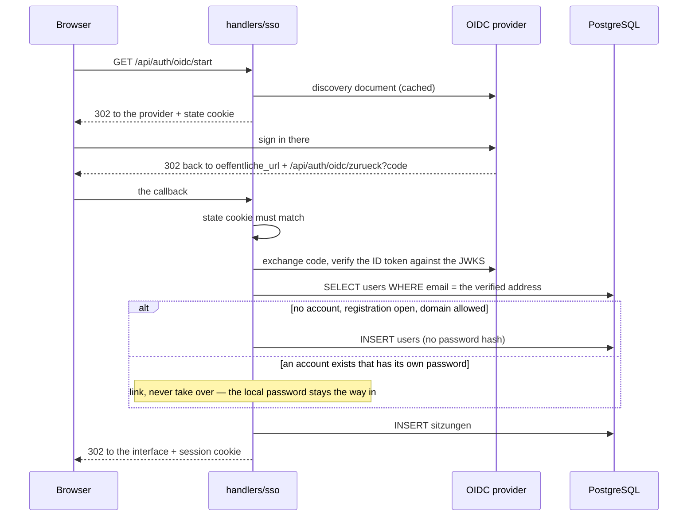

Both external sign-in methods — OIDC here and the LDAP bind in `ldap.go` — link
by **verified email address**, and neither ever takes over an account that has a
password of its own. `oeffentliche_url` has to be set, because the callback
address cannot be derived from a request that has passed through a proxy; a boot
without it is warned about.

### 6.6 The two periodic jobs

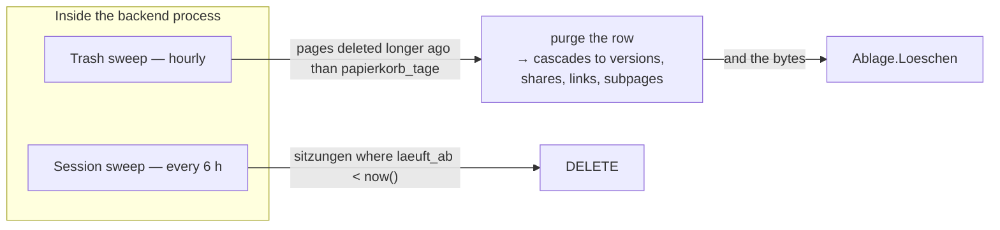

Both are goroutines with a ticker, not containers and not cron entries. Two
jobs do not justify a scheduler, and a job that shares the process shares its
configuration and its database pool.

The trash sweep deletes the **attachment bytes** as well as the rows. Without
that, an object store slowly fills with files no page points at any more — the
kind of leak nobody notices until the bucket is billed.

`papierkorb_tage = 0` switches the expiry off, and pages then stay in the trash
until somebody empties it.

---

## 7. Deployment view

### 7.1 The standard installation

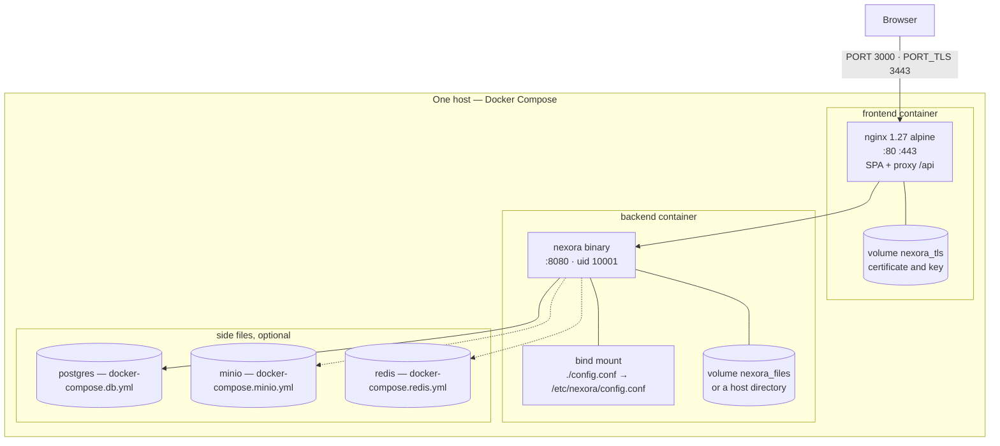

| Element | Detail |
|---|---|
| Published ports | `PORT` (3000) → 80, `PORT_TLS` (3443) → 443. The backend is **not** published; it is reachable only through the frontend container |
| `nexora_tls` | Holds the certificate. Generated self-signed on first start, 825 days. Drop a real `zertifikat.pem` / `schluessel.pem` in and nothing is generated |
| `nexora_files` | Attachment bytes, only while they are on disk. `NEXORA_ANHANG_ORT` replaces it with a host directory or a share — which then has to belong to uid/gid 10001 |
| `config.conf` | Not tracked in git: it holds credentials and is edited from the maintenance page, so a tracked copy would be overwritten on every rollout. Mounted writable, and the file has to belong to gid 10001 for the maintenance page to save it |

### 7.2 Why the database is in a side file

The main compose file contains Nexora and nothing else. PostgreSQL, MinIO and
Redis are services most installations already run, maintained and backed up
somewhere; chaining them to Nexora would mean operating a second copy of each,
or not being able to adopt Nexora at all.

`COMPOSE_FILE` in `.env` selects the combination once so it need not be typed:

```bash
COMPOSE_FILE=docker-compose.yml                                    # bring your own database
COMPOSE_FILE=docker-compose.yml:docker-compose.db.yml              # the default
COMPOSE_FILE=docker-compose.yml:docker-compose.db.yml:docker-compose.minio.yml
COMPOSE_FILE=docker-compose.yml:docker-compose.db.yml:docker-compose.redis.yml
```

### 7.3 Behind a reverse proxy

`chimw.RealIP` is on, so `X-Forwarded-For` is trusted — which is correct behind
a proxy one controls and wrong when the container is exposed to the internet
directly. In front of a proxy, terminate TLS there, forward to `PORT`, and set
`oeffentliche_url` to the address the browser actually uses. Without it the OIDC
callback cannot be built, and a public share link names the wrong host.

### 7.4 Continuous integration

`.github/workflows/pruefen.yml` runs on a self-hosted runner in the maintainer's
network — the only one that reaches the Docker host this instance runs on.

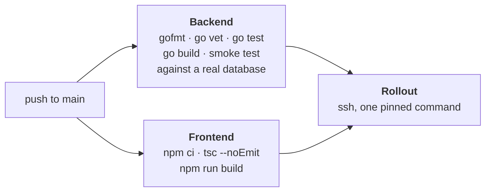

The repository is **public**, and that shapes three things. There is **no
`pull_request` trigger**: a self-hosted runner executes what the workflow says,
and a contribution from outside could bring its own workflow along. The runner
has **no Docker socket**. And the rollout key is **pinned to a single command**
at the target, which can deploy the state of `origin/main` and nothing else.

The smoke test is the step that matters most: `gofmt`, `vet` and the unit tests
touch no database, and that is exactly where the errors live that only appear in
operation.

---

## 8. Cross-cutting concepts

### 8.1 Identity and sessions

| Question | Answer |
|---|---|
| What proves identity? | An httpOnly cookie `nexora_token` carrying a JWT over `{user id, session id}` |
| Why a cookie and not an `Authorization` header? | Script on the page cannot read an httpOnly cookie, which limits what an XSS bug can steal |
| Why a session row as well? | So a session can be **ended**. Signing out revokes the row; the token alone would stay valid until it expired |
| How long? | `sitzung_stunden`, 12 by default. A session in use renews itself once half its life is gone; "last used" is written at most every 5 minutes |
| What about `Secure`? | Set whenever the request arrived over TLS. Not unconditionally, or a home-network instance on plain HTTP could not sign anyone in |
| Passwords | bcrypt. An account created through OIDC or LDAP has no hash and cannot be signed into with a password |

### 8.2 Authorisation

Three concentric questions, each answered in exactly one place:

1. **Is there a valid session?** — `middleware.Auth`. Answers 401.
2. **Is this feature licensed?** — `VerlangeFunktion` on the route group.
   Answers 402.
3. **May this user touch this object?** — `pagePerm` / `isAdmin` in
   `access.go`. Answers 404 (may not read) or 403 (may read, may not write).

Ways access can be granted, strongest first: **owner** → **admin** → **direct
page share** (`read` | `edit`) → **space right** (`lesen` | `schreiben` |
`verwalten`, held directly or through a group) → **open space** (`lesen` |
`schreiben` for every signed-in account of the instance).

"Open space" means the instance, not the internet. Anonymous access runs solely
through a single page's public link, and that link is read-only.

### 8.3 Persistence and schema evolution

One script, `internal/db/db.go`, applied on every start. It has to run against
an empty database and against one already up to date, so:

- tables are `CREATE TABLE IF NOT EXISTS`
- new columns are **appended** as `ALTER TABLE ... ADD COLUMN IF NOT EXISTS`,
  never by editing the `CREATE TABLE` above
- indexes are `CREATE INDEX IF NOT EXISTS`
- constraints that have no `IF NOT EXISTS` are not used; the handler enforces the
  allowed values instead, and what it does not recognise becomes the safe default

The full table-by-table description is in the [data model](data-model.md).

### 8.4 Search

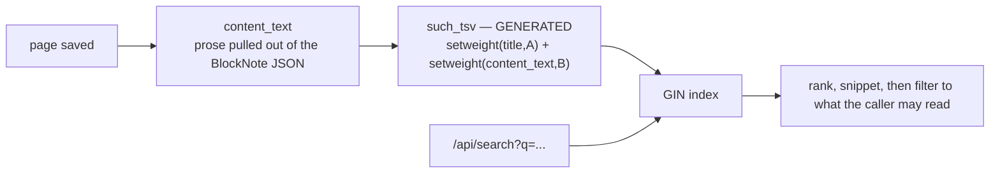

The earlier search ran `ILIKE` over the raw JSON. That matched key names and
block ids, could use no index because of the leading `%`, and knew no ranking.
Now the prose is stored separately and the vector is **generated**, so it cannot
go stale no matter which code path wrote the row. The title carries weight `A`
against the body's `B`, so a page with the term in its title outranks one that
merely mentions it.

The dictionary is `german` by default (`such_woerterbuch`). It costs a little
precision on English content and is clearly better than `simple` for German
pages, because the search then reaches across word forms.

Results are filtered by the same rule that governs opening a single page — there
is no second, looser check for search.

Attachments carry their own `inhalt_text` and `such_tsv`, filled on upload from
`pdftotext`, plain text or `.docx`. Searching them is the `anhangsuche` extra.

### 8.5 The licence gate

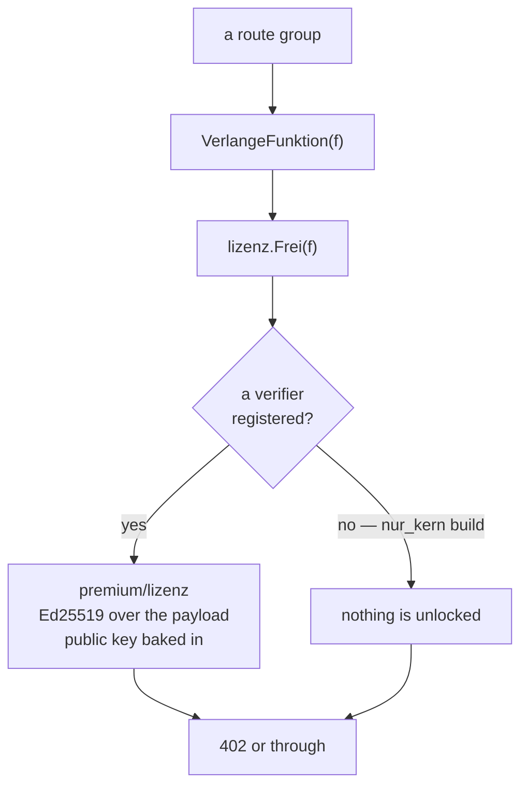

| | |
|---|---|
| **Tiers** | `free` → `advanced` (versionen, anhaenge, kommentare) → `pro` (freigeben, konflikte, export, anhangsuche) → `business` (gruppen, pruefspur, sso, ldap). Each contains the smaller ones |
| **A key** | `payload.signature`, Ed25519. Carries holder, tier and/or individual features, issue date, expiry. Verified against a public key compiled into `pruefer.go` |
| **Offline** | No licence server is contacted, so an air-gapped installation works. The cost: an issued key cannot be revoked, which is why keys carry an expiry of at most a year |
| **Precedence** | A key imported through the admin pages wins over the one in the config file. Otherwise a licence imported in the browser would revert on the next restart |
| **Failure** | A missing or invalid key is never fatal. The reason is logged and the server runs on the free feature set |
| **Recording vs. reading** | The audit trail is written on every installation regardless of licence; only reading it is paid. A trail with a hole over the unlicensed period would not be one |
| **Export asymmetry** | Markdown export and import are free forever — the way out of the system must never sit behind a payment. PDF and Word are typesetting, a presentation rather than an escape route, and those are paid |

### 8.6 Configuration

Precedence, highest first: **environment variable → `config.conf` → built-in
default.** The environment wins so a container can override one value without a
rebuilt image and so a secret never has to touch disk.

The file is looked for at `$NEXORA_CONFIG`, then `./config.conf`, then
`/etc/nexora/config.conf`. **A missing file is not an error** — every setting has
a default that produces a working server, which is what lets the binary start
with no configuration at all. A line without `=` is reported with its number and
skipped; a value that should be a number and is not keeps the default. A typo
must not cause an outage.

Two kinds of setting, and the split is not arbitrary:

| | Lives in | Because |
|---|---|---|
| Database URL, port, JWT secret, data directory | `config.conf` | They are needed before the database is open |
| Registration, allowed domains, attachment limit, session length, trash days, search dictionary, colour scheme | the `einstellungen` table | They may change while running, and nobody can edit a file inside a container from a browser |

The full list with defaults is the [configuration reference](configuration.md).

### 8.7 Attachment storage

`ablage.Ablage` — `Schreiben`, `Lesen`, `Loeschen`, `Name` — with a disk and an
S3 implementation. Beyond tidiness, this is what makes two operational problems
go away: attachments are the part that makes backups awkward and horizontal
scaling impossible, because two containers cannot share a local directory.

A configured object store that does not answer at startup **stops the boot**.
Falling back to disk sounds friendlier than it is: the instance comes up, uploads
work, and weeks later half the attachments lie in a directory nobody backs up
while the other half is in the bucket. `s3_rueckfall = ja` restores the old
behaviour for whoever wants it.

### 8.8 Caching

Redis is optional and is a **cache, never a store of record**: everything in it
also stands in PostgreSQL, so a Redis outage is not an outage of the application,
only a slower one. This is the deliberate difference from the common design of
keeping sessions in Redis alone — there a restart signs everyone out, and losing
it means nobody can say who was signed in.

Keys carry `redis_vorsilbe` so two instances can share one Redis.

### 8.9 Naming

Identifiers are German, prose is English. It is a convention, and it holds
consistently: `pruefspur` is the audit trail, `ablage` is the attachment store,
`postfach` is the inbox, `einlesen` is the import side, `dok` the typesetting.
Once a thing has a name it keeps it, from the column through the handler to the
JSON field — so `postfach` in the browser's network tab is the same `postfach` as
in the schema, with nothing translating in between. Every term is in the
[glossary](#12-glossary).

### 8.10 Error handling

| Situation | Response |
|---|---|
| Bad JSON, missing field | 400 |
| No session, invalid or revoked token | 401, identical for all three |
| May read, may not write | 403 |
| May not read, or does not exist | 404 — the two are not told apart |
| Concurrent edit | 409 with `stand` and who changed it |
| Feature not licensed | 402 with `funktion` and `grund` |
| A panicking handler | `chimw.Recoverer` — the request fails, the process does not |
| A request that will not end | `chimw.Timeout(30s)` |

On the client, `Fehlergrenze` is a React error boundary, so a rendering fault in
one panel does not blank the page.

### 8.11 The audit trail

`pruefspur` records sign-ins including the failed ones, account changes, page
changes, trash, permanent deletion, shares and public links.

**Sign-in attempts** are the one part of it that is free to read, through
`/system/anmeldungen` rather than `/pruefspur`. Who is knocking at the door
belongs to running an instance at all, not to reporting on it, so gating it
behind the `pruefspur` extra would have meant an unlicensed installation cannot
see that it is being attacked. All three ways in — password form, directory,
identity provider — write through one function in `anmeldungen.go`, so a new way
in cannot quietly record less than the others. Each entry carries the address,
the way in, the user agent and, on a failure, why: `Kennung unbekannt` and
`Passwort falsch` are different events even though the caller gets the same
`invalid credentials` either way. Distinguishing them in the response would
enumerate accounts; not distinguishing them in the trail would hide the
difference between an attack on one real account and a spray across invented
ones.

It deliberately has **no foreign key with a cascade**. Actor name, actor address
and object title are frozen copies, so an entry stays readable after the page or
the account it refers to is gone — and deletion is precisely the event an auditor
comes looking for.

The inbox (`postfach`) follows the same rule for who triggered an entry, and the
opposite rule for the page: an entry hangs on the page and disappears with it,
because an inbox entry leading nowhere is nothing but a nuisance.

### 8.12 Building without the paid half

```bash
rm -rf backend/premium
cd backend && go build -tags nur_kern ./...
```

The result is a binary with no licence check compiled in. Every paid extra
answers 402, everything else works unchanged. This is a build the CI could run
and a contributor can run — the free core has to stand on its own, and the only
way to be sure of that is for it to build without the other half present.

---

## 9. Architecture decisions

Each entry: the decision, what it rules out, and what it buys.

### ADR-1: One PostgreSQL holds everything except attachment bytes

**Decision.** No second store of record. Pages, versions, comments, sessions,
the audit trail, the inbox, tags, groups, runtime settings and the imported
licence key are all rows.

**Alternatives rejected.** A document store for the block JSON; sessions in
Redis; the search in an external engine.

**Consequences.** `pg_dump` is a complete backup except for attachment bytes,
which is the single most valuable property a self-hosted system can have.
Transactions cover things that would otherwise need coordination. The cost is
that PostgreSQL is required and not merely supported — `tsvector`, `jsonb`,
`pgcrypto` and generated columns are all load-bearing.

### ADR-2: The schema is one idempotent script

**Decision.** `db.Migrate` applies the whole schema on every start. No migration
tool, no version table, no down-migrations.

**Consequences.** A fresh volume and a three-year-old one reach the same schema
by the same path, and there is no such thing as a partially applied migration.
The price is discipline: a new column has to be **appended** as `ALTER TABLE ...
IF NOT EXISTS` rather than edited into the `CREATE TABLE`, and a genuinely
destructive change (renaming a column, splitting a table) has no support here at
all and would need a hand-written step.

### ADR-3: Sessions are rows, the token only points at them

**Decision.** Every sign-in writes a `sitzungen` row; the JWT carries the session
id; `middleware.Auth` checks both.

**Alternative rejected.** A stateless JWT alone.

**Consequences.** A single device can be locked out. Signing out actually
revokes. The list answers who is signed in right now. Sessions renew while in
use and expire when not. The cost is one primary key lookup per request —
cached, and cheap enough that the alternative was never worth its drawbacks.

### ADR-4: Attachments go through an interface, not a path

**Decision.** `ablage.Ablage` with a disk and an S3 implementation; handlers
never learn which is in use.

**Consequences.** An installation moves to an object store by changing settings.
Horizontal scaling becomes possible, because the local directory is no longer
shared state. A configured store that does not answer stops the boot rather than
silently scattering files across two places.

### ADR-5: The licence gate is middleware, the verifier is deletable

**Decision.** `internal/lizenz` defines features and the gate and contains no
cryptography. `premium/lizenz` registers itself as verifier. `-tags nur_kern`
builds without it.

**Consequences.** Enforcement lives in one place per feature — a route group with
one middleware — instead of scattered through handlers. The free core provably
builds and runs alone. And the split makes the honest statement possible: the
interface hides locked features as a courtesy, the 402 is what enforces them.

### ADR-6: Verification is offline

**Decision.** Ed25519 signature over a self-contained payload, public key
compiled into the binary. No licence server.

**Consequences.** An air-gapped installation works, and no outage of ours can
disable a customer's instance. In exchange, an issued key cannot be revoked, so
expiry dates are the only lever and keys are issued for at most a year.
Replacing the public key invalidates every key ever issued, which is why it is a
constant and not a setting.

### ADR-7: PDF and .docx are written by hand

**Decision.** `internal/dok` implements PDF output, `.docx` output and `.docx`
reading directly.

**Alternative rejected.** A PDF library, a headless browser, LibreOffice in the
image.

**Consequences.** No dependency whose surface exceeds the feature, no external
process to supervise, and a container that stays small. The cost is a deliberate
limit: base fonts and WinAnsi encoding (which is what makes umlauts survive), and
`.docx` round-trips carry text, headings, lists and tables — headers, styles,
comments and images do not survive, and the interface says so before anyone
starts.

### ADR-8: The frontend is served by the thing that proxies the API

**Decision.** One nginx container serves the SPA and `proxy_pass`es `/api`.

**Consequences.** One origin, therefore no CORS configuration and no second
hostname to keep in sync. TLS terminates in one place. The backend need not be
published at all.

### ADR-9: 404 rather than 403 for a page one may not read

**Decision.** Read access and existence are answered together.

**Consequences.** The API cannot be used to discover which page ids exist. Once
read access is established the two cases are separated normally, and a
read-only user gets a plain 403 on a write.

### ADR-10: Dangerous defaults warn, they do not refuse

**Decision.** `Konfig.Warnungen()` names the default JWT secret, the default
database password, LDAP without TLS and the rest at every boot. None of them
prevents the boot.

**Consequences.** A home-lab installation starts on defaults, which is the
behaviour that makes the first five minutes work. It is simply impossible to
miss that it did. The one exception that *does* refuse is a configured object
store that will not answer, because that one loses data quietly rather than
loudly.

---

## 10. Quality requirements

### 10.1 Quality tree

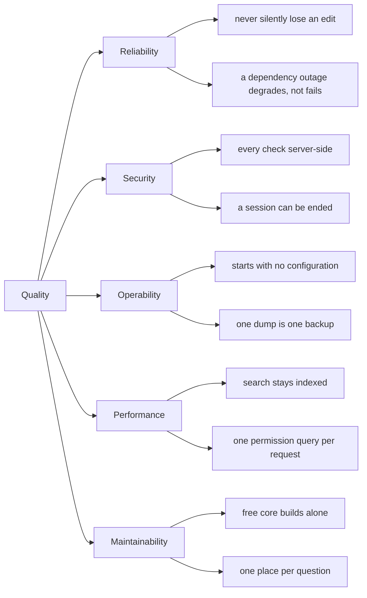

### 10.2 Scenarios

| # | Scenario | Expected behaviour | Realised by |
|---|---|---|---|
| Q1 | Two people edit one page; B saves after A | B is refused with 409 and told who changed it, instead of overwriting | 6.3, conflict detection on `basis` |
| Q2 | Redis goes down | Everything keeps working, a little slower | 8.8 — cache only |
| Q3 | The object store goes down at startup | The boot stops, loudly, rather than writing new attachments to disk | 8.7 |
| Q4 | A laptop with an open session is lost | That one session is ended from the session list; everyone else stays signed in | 8.1 |
| Q5 | A licence expires | Paid routes answer 402, the free feature set carries on, the audit trail keeps recording | 8.5 |
| Q6 | Someone calls a locked endpoint directly, past the interface | 402 from the middleware; hiding was never the protection | 8.2 |
| Q7 | A page is purged after being audited | The audit entries stay readable, with the title the page had then | 8.11 |
| Q8 | `config.conf` has a typo on line 40 | The line is reported with its number and skipped; the server starts on the default | 8.6 |
| Q9 | A workspace grows to tens of thousands of pages | Search stays a GIN index lookup with ranking; the permission check stays one query | 8.4, 5.5 |
| Q10 | A contributor deletes `backend/premium` | Everything builds; paid routes answer 402 | 8.12 |
| Q11 | A user uploads an SVG and shares the page | It is not served as executable content on Nexora's origin | 6.4, `dateiausgabe.go` |
| Q12 | An instance is installed with no config file at all | It starts, warns about the defaults it is using, and works | 8.6, ADR-10 |

---

## 11. Risks and technical debt

| Risk | Impact | Standing mitigation |
|---|---|---|
| **An issued licence key cannot be revoked** | A leaked key unlocks extras until it expires | Expiry of at most a year. Rotating the public key invalidates *every* key, so it is a last resort |
| **`RealIP` trusts `X-Forwarded-For`** | Behind no proxy, a client can forge the IP recorded in the audit trail | Correct behind a proxy one controls; do not expose the container directly |
| **The default JWT secret starts the server** | An instance left on it has forgeable sessions | Warned at every boot; named first in the security checklist |
| **`pgvector`-free search is `german` by default** | Slightly worse recall on English content | `such_woerterbuch` is a setting; changing it needs a reindex (`POST /system/suchindex`) |
| **`.docx` round-trip is lossy** | Headers, styles, comments and images do not survive an edit | The interface says so before the edit starts. Deliberate, see ADR-7 |
| **No `pull_request` CI on a public repository** | External contributions are not built until merged to a branch | Unavoidable with a self-hosted runner; see 7.4 |
| **Destructive schema changes have no path** | A rename or a table split would need a hand-written step | Accepted cost of ADR-2. None has been needed so far |
| **Attachments are outside the database** | A `pg_dump` alone is not a complete backup | Documented in [operations](operations.md); an object store makes this somebody else's backup, which is the point |
| **`metriken.go` is generated and unformatted** | `gofmt -l` would flag it forever | Excluded by name in CI, which is honest but has to be remembered when the generator changes |
| **One maintainer** | Bus factor of one | The reason for the comment style: every non-obvious decision says *why* in the file where it lives |

---

## 12. Glossary

German identifier to English meaning. The left column is what appears in the
schema, the code and the JSON.

| Term | Meaning |
|---|---|
| `ablage` | Attachment store — the interface over disk and S3 |
| `anhang`, `anhaenge` | Attachment(s) |
| `anhangsuche` | Full text search inside attachments (paid extra) |
| `aussteller` | Issuer — of an OIDC discovery document |
| `basis` | The `updatedAt` the editor last saw; what conflict detection compares against |
| `benutzername` | Login name, an alternative to the email address |
| `breite` | Page width — normal or wide |
| `dok` | The typesetting package: PDF and `.docx` |
| `einfuhr` | Import — of Markdown, HTML or a ZIP archive |
| `einlesen` | Parsing — the package that turns Markdown and HTML into blocks |
| `einstellungen` | Runtime settings, the ones that live in the database |
| `erledigt` | Settled — a comment thread marked as dealt with |
| `erwaehnungen` | Mentions — who may be named with `@` |
| `freigeben` | Sharing (paid extra) |
| `funktion` | One paid extra, by name |
| `gesetzt` | Typeset — the PDF and Word export |
| `gruppen` | Groups, and with them space permissions (paid extra) |
| `kennung` | The identifier typed at sign-in: address or login name |
| `kommentare` | Comments (paid extra) |
| `konflikte` | Conflict detection (paid extra) |
| `lizenz` | Licence |
| `oeffentlich` | Public — of a space: `nein`, `lesen`, `schreiben` |
| `papierkorb` | Trash |
| `postfach` | Inbox |
| `pruefspur` | Audit trail (reading it is a paid extra) |
| `rueckfall` | Fallback |
| `schluessel` | Key — a licence key, or a settings key |
| `sitzung`, `sitzungen` | Session(s) |
| `spur` | Trail — the verb form, writing an audit entry |
| `stufe` | Tier: `free`, `advanced`, `pro`, `business` |
| `such_tsv`, `suche` | The search vector, the search |
| `verbund` | The stack around this service: which of the surrounding services answer |
| `versionen` | Version history (paid extra) |
| `vorsilbe` | Prefix — in front of every Redis key |
| `wartung` | Maintenance — the admin page that edits the config and restarts |
| `woerterbuch` | Dictionary — the PostgreSQL text search configuration |
| `zusatz`, `zusaetzlich` | Additional — individual extras a key names beyond its tier |

---

*This document describes `main`. When a decision here stops being true, the fix
is to change the entry, not to add a note beside it.*
