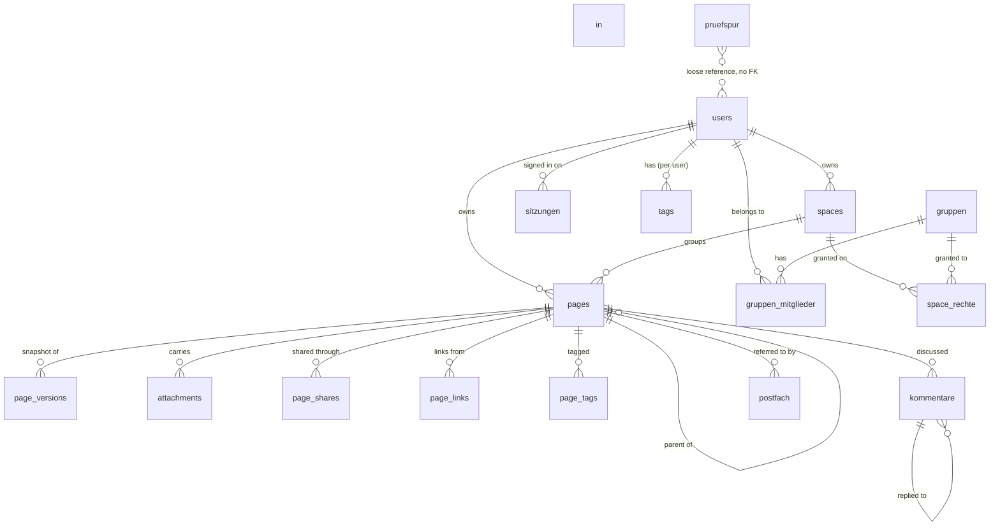

# Data Model

Every table, what it holds, and why it looks the way it does. Nexora keeps
**everything except attachment bytes** in PostgreSQL, so this is the whole
picture of its state.

## How the schema is applied

One script in `internal/db/db.go`, run on every start by `db.Migrate`. It is
idempotent and has to work against an empty database and against one that is
already current:

- tables are `CREATE TABLE IF NOT EXISTS`
- new columns are **appended** as `ALTER TABLE ... ADD COLUMN IF NOT EXISTS`,
  never edited into the `CREATE TABLE` above — so an existing installation picks
  them up on the next start
- indexes are `CREATE INDEX IF NOT EXISTS`
- constraints that have no `IF NOT EXISTS` form are avoided; the handler enforces
  the allowed values instead, and what it does not recognise becomes the safe
  default

There is no migration tool and no version table. A fresh volume and a three-year
old one reach the same schema by the same path, and a partially applied
migration cannot exist.

`pgcrypto` supplies `gen_random_uuid()`, the default for every id.

## Overview

The dotted relation is the interesting one: `pruefspur` deliberately has no
foreign key at all.

---

## Identity

### `users`

| Column | Type | Notes |
|---|---|---|
| `id` | uuid PK | |
| `email` | text UNIQUE | The primary identifier. OIDC and LDAP link by this |
| `name` | text | Display name |
| `benutzername` | text | Login name, the second way in. **Nullable**: an account from SSO or from an older version may not have one, and sign-in by address has to keep working without it. Unique case-insensitively |
| `password_hash` | text | bcrypt. Empty for an account created through OIDC or LDAP |
| `role` | text | `admin` or `user`. The first account ever created becomes `admin` |
| `created_at` | timestamptz | |

### `sitzungen`

One row per sign-in. The token points at it; the row decides whether it counts.

| Column | Type | Notes |
|---|---|---|
| `id` | uuid PK | Travels inside the JWT |
| `user_id` | uuid → users, cascade | |
| `angelegt_am` | timestamptz | |
| `zuletzt_am` | timestamptz | Last used. Written at most every 5 minutes, or every request would be a write |
| `laeuft_ab` | timestamptz | Renewed once half the session's life is gone |
| `widerrufen_am` | timestamptz | Set by sign-out and by ending a session from the list |
| `ip`, `browser` | text | So the session list is recognisable — "this device", "the one at the office" |

Indexed on `user_id` and on `laeuft_ab`; the sweep looks for expired rows, and
without that index it would run over all the valid ones too.

### `gruppen`, `gruppen_mitglieder`

Groups are for the **whole instance**, not per account: a department is not a
private matter, and two people meaning the same group should mean the same one.
`gruppen.name` is unique.

The problem they solve: granting fourteen colleagues access to an area one page
at a time is fourteen clicks per page. A group is the answer, and the space is
the level it is granted on.

---

## Content

### `pages`

| Column | Type | Notes |
|---|---|---|
| `id` | uuid PK | |
| `owner_id` | uuid → users, cascade | |
| `parent_id` | uuid → pages, cascade | Self-referential. Purging a page takes its whole subtree |
| `space_id` | uuid → spaces, **set null** | Deleting a space keeps its pages |
| `title` | text | Default `Untitled` |
| `content` | jsonb | The BlockNote document, verbatim. **The backend never interprets it** |
| `content_text` | text | The prose pulled out of `content` on every save |
| `such_tsv` | tsvector GENERATED | `setweight(title,'A') \|\| setweight(content_text,'B')`. GIN indexed |
| `icon` | text | |
| `breite` | text | `normal`, `breit` or `voll`. On the page, not the account: a twelve-column table needs the width and a scratch note does not, and both live in the same wiki. Width belongs to the typesetting of a text, like a heading |
| `is_public`, `public_token` | boolean, text UNIQUE | The public read-only link |
| `sort_order` | double precision | Order among siblings. A float, so a drag between two pages needs one update rather than renumbering the row |
| `deleted_at` | timestamptz | **The trash.** NULL means live. Every page query has to filter on it |
| `created_at`, `updated_at` | timestamptz | `updated_at` is what conflict detection compares against |

Indexed on `owner_id`, `parent_id`, `space_id`, `deleted_at`, and `such_tsv`
(GIN).

**Why `such_tsv` is generated rather than maintained.** The earlier search ran
`ILIKE` over the raw JSON: it matched key names and block ids, could use no index
because of the leading `%`, and knew no ranking. A generated column cannot go
stale no matter which code path wrote the row — that is the property that made it
worth a non-portable feature.

### `page_versions`

Immutable snapshots, written on save and coalesced so the autosave does not
produce one per keystroke. The snapshot is of the state **before** the edit, so
restoring puts back what was there previously.

`id`, `page_id` (cascade), `title`, `content`, `icon`, `author_id` (set null),
`created_at`. Indexed `(page_id, created_at DESC)`.

### `attachments`

| Column | Type | Notes |
|---|---|---|
| `id` | uuid PK | Also the key in the attachment store — on disk `attachments/<id>`, in a bucket the object name |
| `page_id` | uuid → pages, cascade | |
| `owner_id` | uuid → users, cascade | |
| `filename`, `mime`, `size` | | `mime` is what the uploader claimed and is **not** trusted when serving the file back |
| `inhalt_text` | text | Extracted text: `pdftotext`, plain text, or `.docx` |
| `such_tsv` | tsvector GENERATED | GIN indexed. The `anhangsuche` extra searches this |
| `created_at` | timestamptz | |

The **bytes** are the one part of Nexora outside the database. See
[operations](operations.md#backup) — a `pg_dump` alone is not a complete backup.

### `spaces`, `space_reihenfolge`

`spaces`: `id`, `owner_id`, `name`, `created_at`, plus `oeffentlich` — `nein`,
`lesen` or `schreiben`, meaning open to every signed-in account of the instance.
Not "public on the internet": anonymous access runs exclusively through a single
page's share link. Partially indexed where `oeffentlich <> 'nein'`.

`space_reihenfolge` (`user_id`, `space_id`, `platz`) holds the sidebar order
**per account**, deliberately not as a column on `spaces`. The sidebar is
personal, and a space opened to the whole instance stands in everybody's list —
a shared column would mean whoever drags it last decides the order for everyone
else, including in workspaces they cannot even see. Spaces with no entry sort
after the ordered ones, by name; that is where a newly created space appears
until somebody drags it.

### `tags`, `page_tags`, `favorites`

Tags are **per user**, hence `UNIQUE (owner_id, name)` — two people can each have
a `#draft` that means what they mean. `page_tags` and `favorites` are plain join
tables with composite primary keys.

### `page_links`

`(source_id, target_id)` with a created timestamp. Manual page-to-page links
edited through the interface, independent of the `[[wiki links]]` written into
the text — both feed backlinks and the knowledge graph. Indexed on `target_id`,
which is the direction backlinks read.

---

## Access

### `page_shares`

`(page_id, user_id)` primary key, `permission` — `read` or `edit` — and a
timestamp. Indexed on `user_id`, the direction "what was shared with me" reads.

### `space_rechte`

| Column | Notes |
|---|---|
| `space_id` | → spaces, cascade |
| `gruppe_id` | → gruppen, cascade — **or** |
| `user_id` | → users, cascade |
| `recht` | `lesen` < `schreiben` < `verwalten` |
| `erteilt_am` | |

Two CHECK constraints do real work here:
`CHECK ((gruppe_id IS NULL) <> (user_id IS NULL))` — a right applies to a group
**or** to an account, never both and never neither, because such a row could not
be evaluated and the database is the only place where it is guaranteed never to
come into being. And `CHECK (recht IN ('lesen','schreiben','verwalten'))`.

Two partial unique indexes keep one right per space per subject.

`verwalten` lets somebody grant rights for that space — the person responsible
for an area, without needing a global role for it.

---

## Collaboration

### `kommentare`

| Column | Notes |
|---|---|
| `id`, `page_id` (cascade) | |
| `eltern_id` | → kommentare, cascade. Replies are **one level deep**, enforced by the handler rather than the schema: arbitrarily deep nesting becomes unreadable, and one level covers what people actually do |
| `autor_id` | → users, **set null** |
| `autor_name` | A frozen copy, so a deleted account leaves a readable thread |
| `text`, `erledigt` | `erledigt` marks a thread settled |
| `erstellt_am`, `geaendert_am`, `geloescht_am` | |

`geloescht_am` instead of `DELETE`: a deleted comment with replies hanging off it
would take them along. Deleting empties the text and keeps the shell, so the
thread holds together.

### `postfach`

The inbox. Without it a comment reached nobody — it stood under a page and waited
for somebody to open it again by chance, and a question that goes unanswered for
a week is no longer a question.

| Column | Notes |
|---|---|
| `empfaenger_id` | → users, cascade |
| `art` | Which kind of entry |
| `page_id` | → pages, cascade — the entry disappears with the page, because an inbox entry leading nowhere is a nuisance |
| `kommentar_id` | → kommentare, cascade |
| `ausloeser_id` | → users, set null |
| `ausloeser_name`, `seiten_titel`, `text` | Frozen copies, so an entry stays readable when the account that triggered it is gone |
| `gelesen_am`, `erstellt_am` | |

Indexed `(empfaenger_id, erstellt_am DESC)`, plus a **partial** index on unread
only — almost every query asks for the unread, and that is the small part of the
table.

### `pruefspur`

| Column | Notes |
|---|---|
| `id` | bigserial |
| `zeitpunkt` | |
| `akteur_id` | uuid, a **loose** reference — no foreign key |
| `akteur_name`, `akteur_email` | Frozen at that moment |
| `aktion` | e.g. `anmeldung`, `anmeldung_fehlgeschlagen`, `seite_geaendert` |
| `objekt_art`, `objekt_id`, `objekt_titel` | What it referred to, and what it was called then |
| `details` | jsonb |
| `ip` | |

**No foreign key with a cascade anywhere in this table**, and that is the whole
design. An entry has to survive the deletion of the page or the account it refers
to, because deleting is precisely the event a review comes looking for. Four
indexes cover the four ways it is read: by time, by actor, by object, by action.

---

## Operations

### `einstellungen`

`schluessel` PK, `wert`, `geaendert_am`, `geaendert_von`. The settings that may
change at runtime, which cannot live in `config.conf` because nobody can edit a
file inside a container from a browser. The other way round, the database address
does not belong here: it is needed before the database is open.

Current keys: `registrierung_offen`, `erlaubte_domaenen`, `max_anhang_mb`,
`sitzung_stunden`, `papierkorb_tage`, `such_woerterbuch`, `design_grundton`,
`design_akzent` — plus the imported licence key, which takes precedence over the
one in the file.

---

## Deletion semantics

| Action | Effect |
|---|---|
| Delete a page | `deleted_at` is set. It is in the trash, recoverable, and hidden from every query |
| Purge a page | The row goes, cascading to its versions, attachments, shares, links, tags **and subpages**. The attachment bytes are removed too |
| Trash sweep | Hourly. Purges pages deleted longer ago than `papierkorb_tage` (0 disables it) |
| Delete a space | The space goes; its pages stay and their `space_id` becomes NULL |
| Delete an account | Cascades to its pages, spaces, tags, favourites, sessions and group memberships. Its comments keep the frozen author name; its audit entries stay entirely |
| Delete a comment | The text is emptied, the row stays, replies keep their place |
| Delete a group | Cascades to memberships and to the space rights granted to it |
